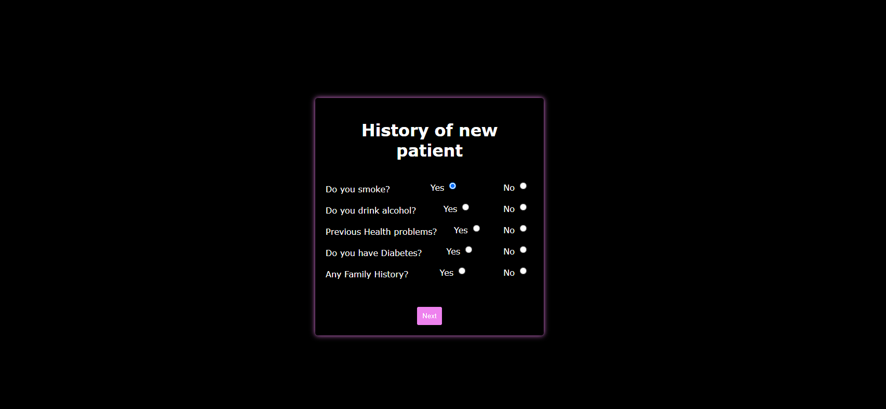
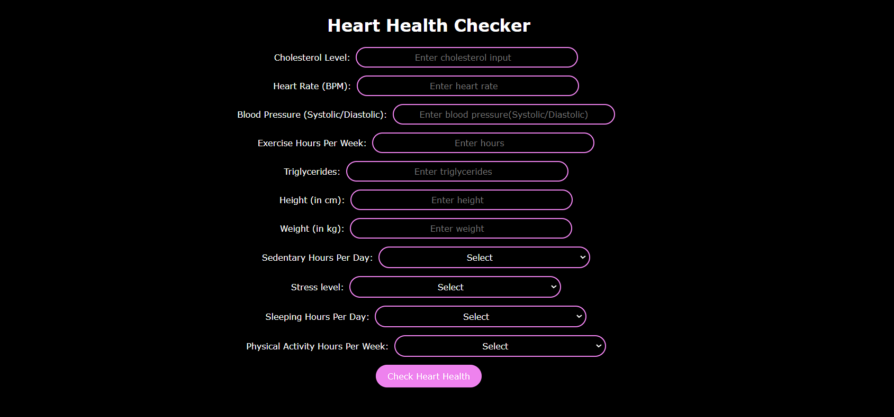
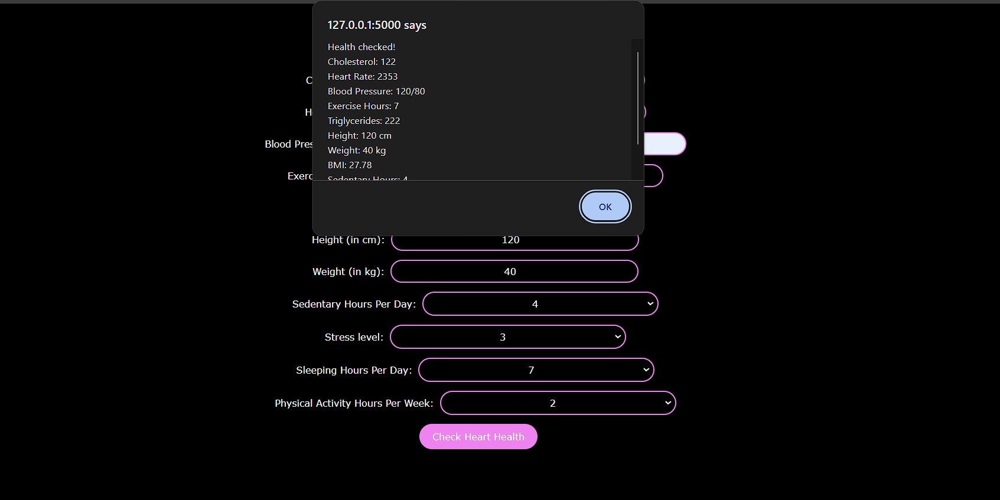

# Heart-Health-Prediction-Website-Using-ML
Overview:
This interactive website predicts heart health using machine learning algorithms. Users input relevant health data, and the system provides predictions along with explanations.

Features:

User Input: Users input health data like age, gender, blood pressure, cholesterol levels, etc.
Prediction: Machine learning algorithms predict heart health based on the input data.
Explanations: Users receive explanations of predictions, highlighting influential factors.
Visualizations: Graphical representations of risk factors and prediction outcomes.
Recommendations: Tailored recommendations for improving heart health based on predictions.
Implementation:

Frontend: HTML, CSS, JavaScript for user interface.
Backend: Python with Flask for server-side processing.
Machine Learning: Used Random Forest ALgorithm

## Usage Commands

1. *Installation:*
   ```bash
   git clone https://github.com/Noniesh30/Hacathon.git
   
2. *Running the System:*
   python app.py

3. *Accessing the System:*
  Accessing the System:


 
## Login and Signup


## Patient History



## Heart Health Checker



## Heart Conditions



## Result

